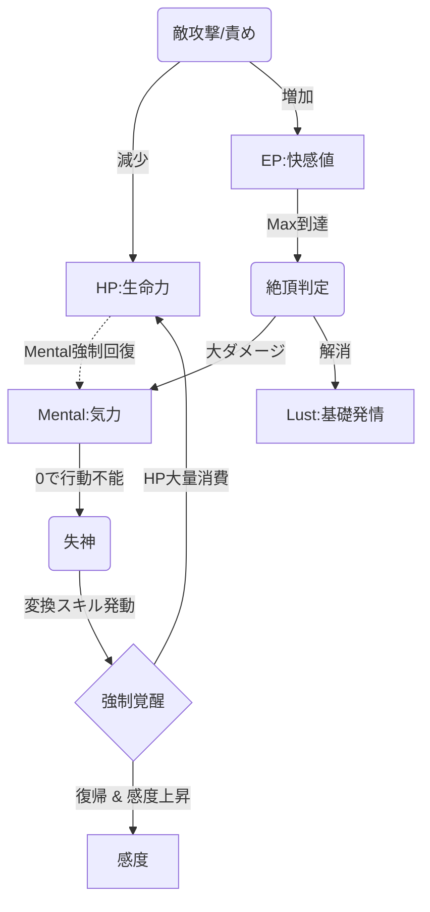
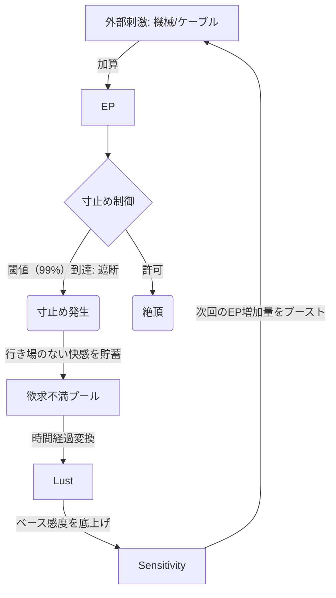
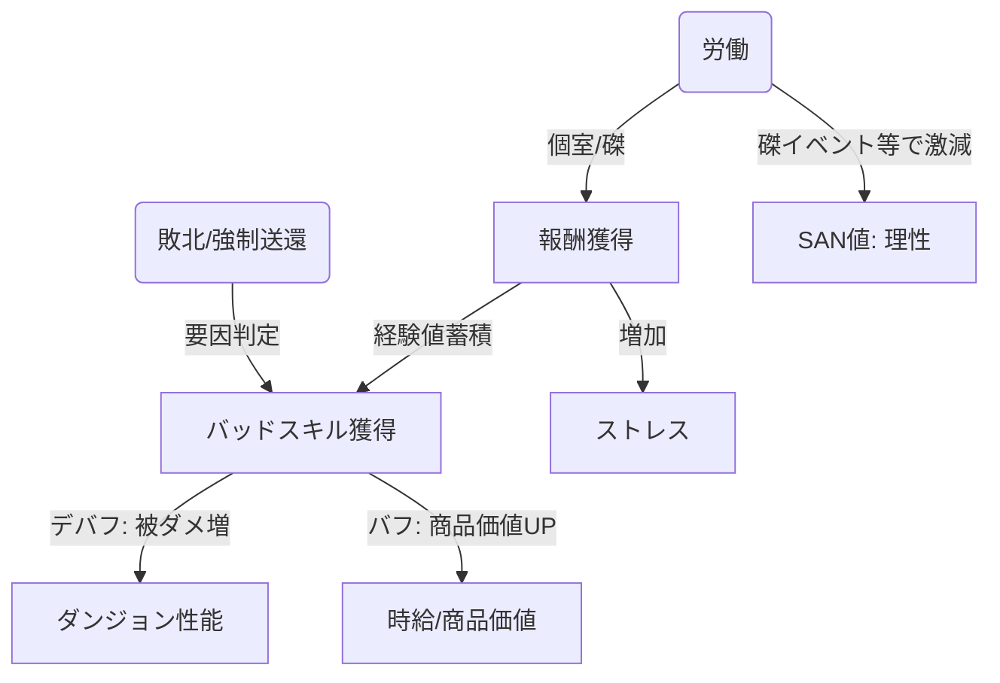

# 堕落と循環のゲームシステム設計書 (Corruption & Cycle System Design)

## 1. システム概要 (System Overview)

本システムは、以下の互いに干渉し合う3つの循環エンジンによって構成される。
プレイヤーキャラクターはこれらのサイクルの中でリソースをすり減らし、あるいは変換しながら、破滅と快楽の狭間を彷徨うことになる。

1. **生存機関 (Survival Engine)**: ダンジョン攻略とリソース管理。生命力(HP)を精神力(Mental)へ変換し、ゲームオーバーを回避する。

2. **快楽機関 (Eros Engine)**: 戦闘中の性的ステータス、寸止め、絶頂管理。

3. **経済機関 (Economy Engine)**: 敗北によって得た「傷（バッドスキル）」を、娼館での「商品価値」に転換する。

---

## 2. 生存・快楽機関 (Survival & Eros Engine)

HPをMentalへ変換して稼働し続ける「生気変換」と、絶頂によるダメージ管理を行う戦闘の中核システム。

### 2.1 生存機関パラメータ (Survival Parameters)
| 変数名 | 型 | 説明・用途 |
| :--- | :--- | :--- |
| **`HP`** / **`MaxHP`** | `int` | 生命力。0で敗北/強制排出。「生気変換」の燃料となる。 |
| **`Mental`** | `int` | 気力。0で失神（行動不能）。絶頂するたびに減少する。 |
| **`SP`** | `int` | スタミナ。行動で消費。0で脱力状態。 |
| **`Awakening_State`** | `bool` | 「強制覚醒」フラグ。ONの間はHPが継続減少し、Mentalが底上げされる。 |

### 2.2 快楽機関パラメータ (Eros Parameters)
| 変数名 | 型 | 説明・用途 |
| :--- | :--- | :--- |
| **`EP`** (Excite Point) | `float` | 快感蓄積値。`Sensitivity` × `Stimulation` で増加。 |
| **`Lust`** | `int` | 基礎発情度。高いとEPの自然減衰がなくなり、常に興奮状態となる。 |
| **`Sensitivity_Base`** | `float` | 基礎感度倍率。レベルや装備で変動。 |
| **`Sensitivity_Multi`** | `float` | 戦闘中の一時的な感度バフ（薬、スキル効果）。 |
| **`Orgasm_Count`** | `int` | 絶頂回数累計。Mentalダメージ係数に影響を与える。 |

---

## 3. 快楽制御機関 (Control & Denial Engine)

「寸止め中毒」や「機械管理」による、快楽の蓄積と管理ロジック。

### 3.1 制御パラメータ定義 (Control Parameters)

| 変数名 | 型 | 説明・用途 |
| :--- | :--- | :--- |
| **`Frustration_Pool`** | `float` | 寸止めされた快感の蓄積プール。 |
| **`Min_EP_Floor`** | `float` | EP下限値。ケーブル/ローター接続時はこれ以下に下がらない。 |
| **`Denial_Level`** | `int` | 寸止め強度。高いほどFrustrationの蓄積効率が上がる。 |
| **`Connected_Device`** | `Enum` | 接続機器ID (`None`, `Cable`, `Rotor`, `Pillory`)。 |
| **`Orgasm_Queue`** | `int` | 「連続絶頂愛好家」用の未消化絶頂スタック数。 |

---

## 4. 経済機関・バッドスキル (Economy & BadSkills Engine)

ダンジョンでの「傷（Bad Skill）」が、娼館での「商品価値（Value）」に反転するロジック。

### 4.1 経済パラメータ定義 (Economy Parameters)

| 変数名 | 型 | 説明・用途 |
| :--- | :--- | :--- |
| **`Market_Value`** | `int` | キャラクターの時給。所持バッドスキルの評価合算値。 |
| **`Customer_Rate`** | `float` | 集客率。「磔イベント」などで一時的にブーストされる。 |
| **`Total_Debt`** | `int` | 借金総額。返済できない場合、ペナルティイベントが発生。 |
| **`SAN`** (Sanity) | `float` | 理性値(0~100%)。0になると廃人化、または完全自動行動モードへ移行。 |
| **`Stress`** | `int` | ストレス値。労働で蓄積。限界突破で発狂イベント。 |

### 4.2 バッドスキル構造体 (BadSkill Struct)

| プロパティ名 | 型 | 説明 |
| :--- | :--- | :--- |
| **`ID`** | `string` | スキルID（例: `"Masochist"`, `"SemenAddict"`）。 |
| **`Level`** | `int` | 進行度 (1~10)。 |
| **`Dungeon_Effect`** | `float` | ダンジョンでのデバフ倍率。 |
| **`Brothel_Effect`** | `float` | 娼館での指名料・評価倍率。 |
| **`Target_Tag`** | `string` | 引き寄せる客の属性タグ（`"Orc"`, `"Noble"`等）。 |

---

## 5. インベントリ・特殊状態 (Inventory & Special States)

通常のアイテム欄とは別に管理される、身体の状態。

| 変数名 | 型 | 説明 |
| :--- | :--- | :--- |
| **`Womb_Content`** | `Class` | 子宮内スロット。 `{Type: "Egg", Timer: 100, Father: "Dragon"}` |
| **`Semen_Amount_Womb`** | `float` | 膣内精液量（妊娠判定/お腹ぽっこり差分用）。 |
| **`Semen_Amount_Stomach`**| `float` | 飲精量（精液中毒経験値用）。 |
| **`Costume_ID`** | `Enum` | 現在の衣装ID (`Armor`, `OL_Suit`, `Maid`, `Bondage`)。 |

---

## 6. クラス設計推奨案 (Class Architecture Hints)

実装時は以下のManagerクラスに責務を分割することを推奨する。

* **`VitalityManager`**:
    * HP, Mental, AwakeningState の管理。
    * 生気変換ロジック (`ConvertHPtoMental()`) の実装。

* **`SensationManager`**:
    * EP, Orgasm, Denial, Lust の計算。
    * `Update()` 毎に `Frustration_Pool` を計算し、感度へフィードバックする。

* **`CorruptionManager`**:
    * BadSkill, Money, SAN の計算。
    * `GetHourlyRate()` で現在の時給を算出。
    * 労働時の客層抽選ロジック (`LotteryCustomer()`) の実装。
