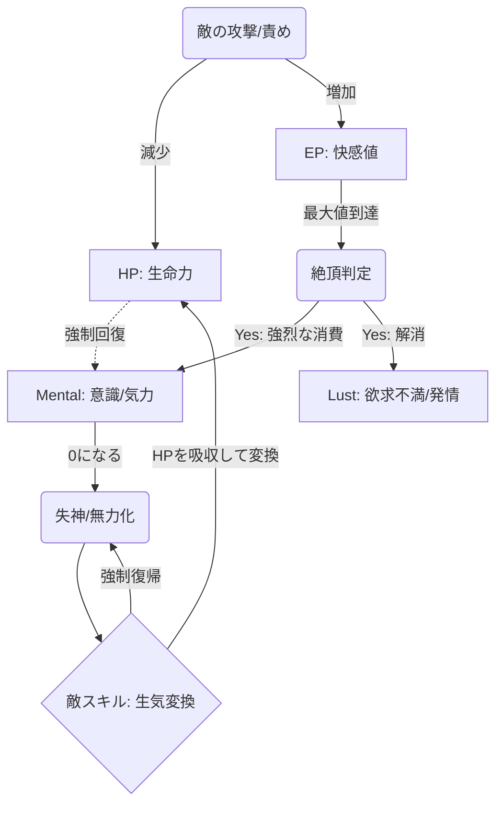
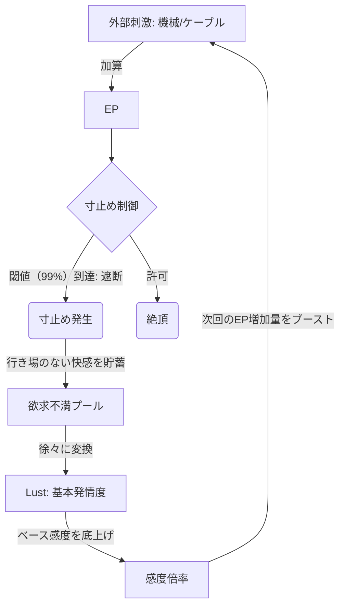
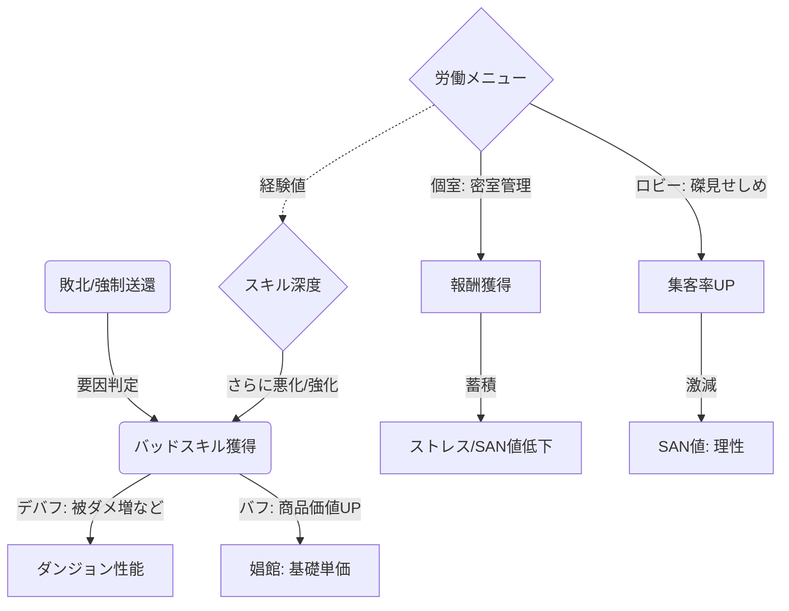

# 基本設計書: 堕落と循環のゲームシステム (Corruption & Cycle System)

## 1. 概要 (Overview)
本システムは、以下の3つの循環エンジンによって構成される。
1.  **生存機関 (Survival)**: ダンジョン攻略とリソース管理。
2.  **快楽機関 (Eros)**: 戦闘中の性的ステータスと強制覚醒。
3.  **経済機関 (Economy)**: 敗北によるバッドスキル獲得と、娼館での価値転換。

---

## 2. 生存機関と快楽機関 (Survival & Eros Engine)
HPをメンタルに変換して稼働し続ける「生気変換」と「強制覚醒」のロジック。

### 主要パラメータ (Parameters)

| 変数名 | 型 | 説明・役割 |
| :--- | :--- | :--- |
| **`HP`** | `int` | 生命力。0で敗北。「生気変換」のリソース源となる。 |
| **`Mental`** | `int` | 気力。0で行動不能。絶頂するたびに減少する。 |
| **`EP`** (Excite Point) | `float` | 快感蓄積値。`Sensitivity` × `Stimulation` で増加。 |
| **`Orgasm_Count`** | `int` | 絶頂回数。回数が多いほどMentalダメージ倍率が上昇。 |
| **`Awakening_State`** | `bool` | 「強制覚醒」フラグ。ONの間はHPが継続減少し、Mentalが底上げされる。 |

---

## 3. 快楽制御機関 (Control & Denial Engine)
「寸止め中毒」や「機械管理」による、快楽の蓄積と管理ロジック。

### 主要パラメータ (Parameters)

| 変数名 | 型 | 説明・役割 |
| :--- | :--- | :--- |
| **`Frustration_Pool`** | `float` | 寸止めされた快感の蓄積プール。時間経過でLustやStressに変換。 |
| **`Lust`** (Libido) | `int` | 基礎発情度。高いとEPの自然減少が停止し、常に興奮状態になる。 |
| **`Min_EP_Floor`** | `float` | EPの下限値。ケーブル/ローター接続時はこれ以下に下がらない。 |
| **`Denial_Level`** | `int` | 寸止め強度。高いほどFrustrationの蓄積効率が上がる。 |

---

## 4. 経済機関とバッドスキル (Economy & Bad Skills Engine)
ダンジョンでの「傷（Bad Skill）」が、娼館での「商品価値（Value）」に反転するロジック。

### 主要パラメータ (Parameters)

| 変数名 | 型 | 説明・役割 |
| :--- | :--- | :--- |
| **`BadSkill_List`** | `List<Skill>` | 所持スキルリスト。各スキルが`Price_Multiplier`（価格倍率）を持つ。 |
| **`Market_Value`** | `int` | 1時間あたりの基本価格。BadSkillの質と量で決定。 |
| **`Customer_Rate`** | `float` | 集客率。「磔イベント」などで一時的にブーストされる。 |
| **`SAN`** (Sanity) | `int` | 理性値。0になると廃人化、または完全自動行動モードへ移行。 |
| **`Debt`** | `int` | 借金総額。返済できない場合、ペナルティイベントが発生。 |

---

## 5. インベントリ・状態管理 (Inventory & State)

| カテゴリ | パラメータ名 | 型 | 説明 |
| :--- | :--- | :--- | :--- |
| **身体スロット** | **`Womb_Content`** | `Class` | 子宮内状態。`{Type: "Egg", Timer: 100}`。敏捷性低下などのデバフ付与。 |
| **装備状態** | **`Costume_ID`** | `Enum` | 現在の衣装。`Armor`（防御）、`OL_Suit`（精神ダメ増/羞恥）など。 |
| **接続状態** | **`Connected_Device`** | `Enum` | `None`, `Cable`, `Pillory`(磔)。行動制約とEP下限値を決定。 |

## 6. クラス設計のヒント (Architecture Hints)

* **`VitalityManager`**: HP, Mental, 生気変換の計算を担当。
* **`SensationManager`**: EP, 絶頂, 寸止め, Lustの計算を担当。毎フレーム `Frustration` を更新。
* **`CorruptionManager`**: バッドスキル, 娼館の価格, SAN値の計算
